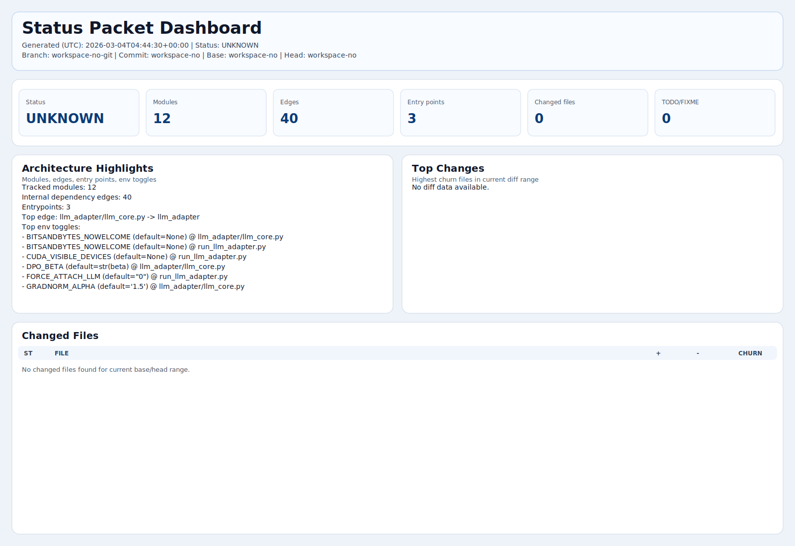

# STATUS_PACKET



## Snapshot

| Field | Value |
| --- | --- |
| Generated At (UTC) | `2026-03-04T04:44:30+00:00` |
| Status | **UNKNOWN** |
| Branch | `workspace-no-git` |
| Commit | `workspace-no` |
| Base SHA | `workspace-no` |
| Head SHA | `workspace-no` |
| Revision Source | `source_revision.json` |

## Key Metrics

| Metric | Value |
| --- | --- |
| `hf_generation_failure_rate` | `0` |
| `bus_jsonl_parse_error_rate` | `0` |
| `unknown_abstain_ratio` | `0` |
| `response_repeat_ratio` | `0.375` |

## Latest Run Summary

```json
null
```

## Architecture Highlights

| Metric | Value |
| --- | --- |
| Tracked modules | `12` |
| Dependency edges | `40` |
| Entry points | `3` |
| Tracked classes | `39` |
| Top-level functions | `37` |
| Class methods | `156` |
| Changed files | `0` |

Top dependency edges:

- `llm_adapter/llm_core.py -> llm_adapter`
- `llm_adapter/llm_core.py -> llm_adapter.config`
- `llm_adapter/llm_core.py -> llm_adapter.control_plane`
- `llm_adapter/llm_core.py -> llm_adapter.layers`
- `llm_adapter/llm_core.py -> llm_adapter.m3_control_bridge`
- `llm_adapter/llm_core.py -> llm_adapter.meaning_pipeline`
- `llm_adapter/llm_core.py -> llm_adapter.memory`
- `llm_adapter/llm_core.py -> llm_adapter.remote`
- `+32 more`

Top env toggles:

| Variable | Default | File |
| --- | --- | --- |
| `BITSANDBYTES_NOWELCOME` | `None` | `llm_adapter/llm_core.py` |
| `BITSANDBYTES_NOWELCOME` | `None` | `run_llm_adapter.py` |
| `CUDA_VISIBLE_DEVICES` | `None` | `run_llm_adapter.py` |
| `DPO_BETA` | `str(beta` | `llm_adapter/llm_core.py` |
| `FORCE_ATTACH_LLM` | `"0"` | `run_llm_adapter.py` |
| `GRADNORM_ALPHA` | `'1.5'` | `llm_adapter/llm_core.py` |
| `HF_HUB_DISABLE_PROGRESS_BARS` | `None` | `llm_adapter/llm_core.py` |
| `HF_HUB_DISABLE_PROGRESS_BARS` | `None` | `run_llm_adapter.py` |
| `HF_HUB_VERBOSITY` | `None` | `llm_adapter/llm_core.py` |
| `HF_HUB_VERBOSITY` | `None` | `run_llm_adapter.py` |

`+200 more toggles`

## Top Changed Files

- No diff data available for the current base/head range.

## Risks & TODO Summary

- No TODO/FIXME markers found in scanned source files.

## Repro Commands

```bash
python docs_tests_data/tests/build_status_packet.py \
  --repo-root . \
  --out-dir docs_tests_data \
  --artifacts-dir docs_tests_data
```

## Output Contract

- `docs_tests_data/STATUS_PACKET.md`
- `docs_tests_data/VISUAL_MAP.svg`

Legacy packet outputs are cleaned automatically by this generator.
