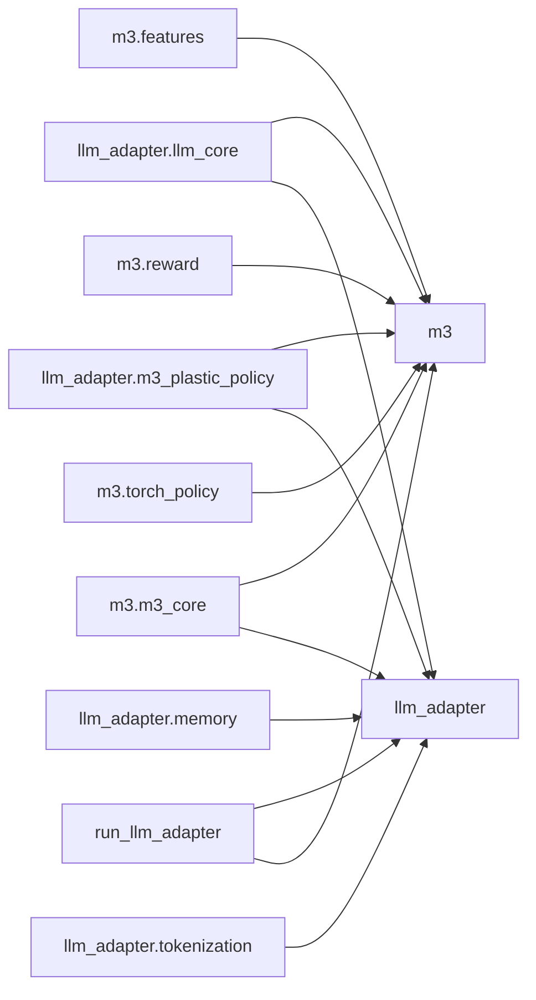
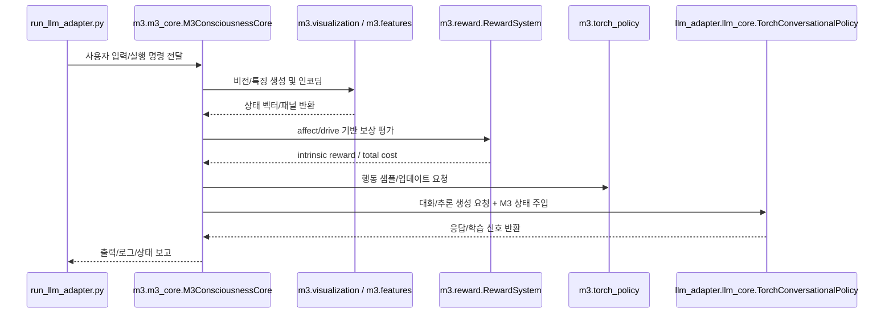
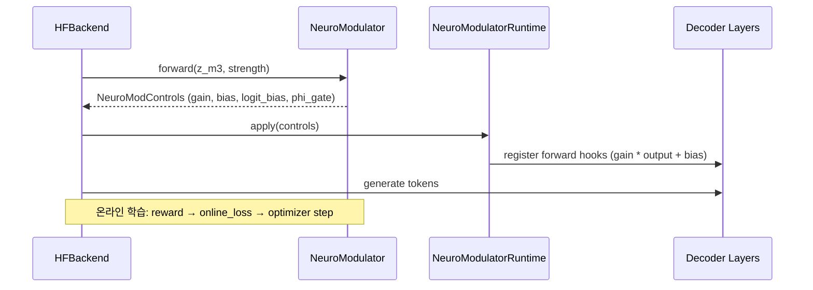

# M3 Repository Architecture README

이 문서는 이 저장소의 **모든 Python 코드 파일**(모듈/클래스/함수/메서드)과 상호 연결 로직을 정리한 상세 아키텍처 문서입니다.
This README provides a architecture map of all Python modules/classes/functions and their integration flows.

## 1) 전체 구조 요약

- 핵심 코어: `m3/m3_core.py` (`M3ConsciousnessCore` 중심)
- 인지/보상/정책: `m3/features.py`, `m3/reward.py`, `m3/torch_policy.py`, `m3/visualization.py`
- LLM 통합 레이어: `llm_adapter/` 전체 + `run_llm_adapter.py`
- 설정/디바이스: `m3/config.py`, `m3/device.py`, `llm_adapter/config.py`

## 2) 모듈 의존성 이미지 (Mermaid)

## 3) 런타임 연결 흐름 이미지

## 4) 파일별 코드 인벤토리 (모듈/클래스/함수/메서드)

### `llm_adapter/__init__.py`
- 모듈명: `llm_adapter`
- 코드 라인 수: **66**
- Top-level 클래스 수: **0** / Top-level 함수 수: **0**

**클래스 목록**: 없음

**함수 목록**: 없음

### `llm_adapter/config.py`
- 모듈명: `llm_adapter.config`
- 코드 라인 수: **564**
- Top-level 클래스 수: **22** / Top-level 함수 수: **6**

**클래스 목록**
- `M3StateEncoderConfig` (line 18)
- `M3StateCacheConfig` (line 32)
- `M3AwareDecoderLayerConfig` (line 45)
- `M3AdaptiveSamplerConfig` (line 57)
- `M3EpisodicMemoryConfig` (line 72)
- `KNNIndexConfig` (line 81)
- `TokenizerConfig` (line 89)
- `TorchPolicyConfig` (line 102)
- `PlasticBitLinearConfig` (line 128)
- `M3PlasticPolicyConfig` (line 136)
- `AutonomyRLConfig` (line 146)
- `EpisodicANNConfig` (line 174)
- `DPOAutoCollectConfig` (line 187)
- `EarlyStopConfig` (line 198)
- `BridgeAdaptConfig` (line 210)
- `TokenizerAutoVocabConfig` (line 222)
- `StabilityConfig` (line 239)
- `AdaptiveThresholdConfig` (line 259)
- `ObservationAdapterConfig` (line 273)
- `ConsciousnessBusConfig` (line 282)
- `NeuroModulatorConfig` (line 293) — NeuroModulator weight-level consciousness control 설정
- `M3LLMConfig` (line 327) → methods: `from_json`, `to_json`

**함수 목록**
- `set_global_config` (line 423)
- `get_global_config` (line 429)
- `create_default_config_file` (line 439)
- `load_config_from_file` (line 448)
- `print_config_summary` (line 455)
- `validate_config` (line 494)

### `llm_adapter/layers.py`
- 모듈명: `llm_adapter.layers`
- 코드 라인 수: **133**
- Top-level 클래스 수: **1** / Top-level 함수 수: **0**

**클래스 목록**
- `PlasticBitLinear` (line 9) → methods: `__init__`, `forward`, `_quantize_weight`, `_hebbian_update`, `consolidate`, `extra_repr`

**함수 목록**: 없음

### `llm_adapter/llm_core.py`
- 모듈명: `llm_adapter.llm_core`
- 코드 라인 수: **7984**
- Top-level 클래스 수: **8** / Top-level 함수 수: **3**

**클래스 목록**
- `M3StateEncoder` (line 154) → methods: `__init__`, `_infer_nhead`, `_infer_fusion_layers`, `_infer_dropout`, `_lazy_init_projections`, `forward`
- `M3StateCache` (line 373) → methods: `__init__`, `_infer_cache_size`, `_infer_phi_trend_window`, `update`, `get_current_panels`, `get_phi_trend`
- `M3AwareDecoderLayer` (line 484) → methods: `__init__`, `_infer_nhead`, `_infer_dropout`, `forward`
- `M3AdaptiveSampler` (line 590) → methods: `__init__`, `_compute_temperature`, `_compute_top_k`, `sample`
- `HFBackend` (line 790) → methods: `get_instance`, `is_available`, `__init__`, `_ensure_loaded`, `_bridge_enabled`, `_bridge_enabled_safe`, `_note_control_health`, `_compute_recent_control_stats`, `_auto_control_selection`, `_control_selection_mode`, `_control_allows`, `_ensure_control_bridge`, `_neuro_enabled`, `_ensure_neuro_modulator`, `_save_neuro_checkpoint`, `_load_neuro_checkpoint`, `_neuro_status`, `_prepare_bridge_state`, `_micro_update_step_state`, `_sample_next_token`, `_token_critic_enabled`, `_compute_sample_params`, `_apply_bridge_logit_bias`, `_apply_token_value_injection`, `_resolve_forbidden_token_ids`, `_apply_decode_control_params`, `generate_with_m3`
- `TorchConversationalPolicy` (line 1570) → methods: `__init__`, `_is_numeric_dump_response`, `_is_backend_status_text`, `_is_refusal_disclaimer`, `_is_identity_drift_output`, `_is_disallowed_generation_output`, `_system_prompt_mode`, `_system_prompt_enabled`, `_get_system_prompt`, `_verifier_tokens`, `_evaluate_generation_quality`, `_read_float`, `_read_int`, `_resolve_generation_sampling`, `_retry_generation_sampling`, `_strip_similar_context_block`, `_is_cuda_fatal_error`, `_trip_hf_circuit_breaker`, `_extract_last_user_text`, `_detect_language`, `_is_autonomy_prompt`, `_should_include_m3_state`, `_is_state_request`, `_build_decode_control`, `_sanitize_training_record`, `_generate_safe_fallback`, `save_model`, `_record_example`, `enable_m3_integration`, `_normalize_affect_state`, `_get_affect_state`, `_update_m3_cache`, `_build_m3_memory`, `build_m3_memory`, `_vectorize_panels`, `_snapshot_vector`, `_build_full_state_vector`, `_build_m3_context`, `start_credit_consumer`, `stop_credit_consumer`, `_state_vector`, `_build_autonomy_prefix`, `_run_core_steps`, `_run_checkpoint_if_enabled`, `_drain_user_message`, `_handle_user_turn`, `_wait_for_user_interrupt`, `_run_autonomy_turn`, `start_autonomy_loop`, `stop_autonomy_loop`, `submit_user_message`, `_autonomy_seed_prompt`, `_parse_user_m3_transcript`, `_unified_loop`, `_consume_credits`, `_process_credit_message`, `load_model`, `_beta_schedule`, `_update_task_weights_gradnorm`, `_normalize_targets`, `_alpha_scheduler_uncertainty`, `_log_jsonl`, `_adv_headroom`, `_looks_like_toolcall`, `_sample_toolcall_variants`, `_quick_eval_proxy`, `_predict_value_scalar`, `_build_cond_key`, `_sample`, `_build_hf_quality_gate_inputs`, `_generate_with_hf`, `_apply_quality_gate_if_enabled`, `_semantic_perspective_prefix`, `embed_text`, `generate`, `score_value`, `collect_knn_from_teacher`, `learn_pair`, `train_batch`, `train_on_example`, `train_dpo_from_dir`, `_extract_supervised_pair`, `_iter_supervised_records_from_dir`, `train_supervised_from_dir`, `evaluate_supervised_from_dir`, `evaluate_dpo_from_dir`, `auto_train_and_test_from_data_set`, `train_all_from_data_set`, `_sequence_logprob`, `dpo_step`, `dpo_batch_step`, `_is_empty_prompt_or_response`, `train_value_head`, `train_token_value_head`
- `UnifiedM3Policy` (line 5460) → methods: `__init__`, `set_motor_policy`, `sample_action`, `update_motor`
- `PlasticBrainPolicy` (line 5487) → methods: `__init__`, `sample`, `_state_vector`, `learn`, `generate`

**함수 목록**
- `_resolve_torch_device` (line 1562)
- `_attach_control_compat` (line 5544)
- `attach_llm_to_core` (line 5617)

### `llm_adapter/m3_control_bridge.py`
- 모듈명: `llm_adapter.m3_control_bridge`
- 코드 라인 수: **649**
- Top-level 클래스 수: **8** / Top-level 함수 수: **2**

**클래스 목록**
- `M3BridgeControls` (line 13)
- `M3ControlBridge` (line 19) → methods: `__init__`, `_prepare_state`, `forward`, `regularization_loss`, `renorm_parameters`
- `LayerGateRuntime` (line 148) → methods: `__init__`, `close`, `apply`
- `QualityGateResult` (line 199)
- `GenerationQualityGate` (line 206) → methods: `__init__`, `_features`, `evaluate`
- `NeuroModControls` (line 320) — per-layer neural modulation controls
- `NeuroModulator` (line 329) → methods: `__init__`, `_prepare_state`, `_warmup_factor`, `forward`, `online_loss`, `renorm_parameters`, `maybe_apply_spectral_norm`
- `NeuroModulatorRuntime` (line 582) → methods: `__init__`, `apply`, `close`

**함수 목록**
- `_to_module_list` (line 103)
- `find_decoder_layers` (line 113)

### `llm_adapter/m3_plastic_policy.py`
- 모듈명: `llm_adapter.m3_plastic_policy`
- 코드 라인 수: **270**
- Top-level 클래스 수: **1** / Top-level 함수 수: **0**

**클래스 목록**
- `M3PlasticPolicy` (line 15) → methods: `__init__`, `encoder`, `reset_state`, `forward`, `sample`, `sleep`, `learn_from_text`

**함수 목록**: 없음

### `llm_adapter/memory.py`
- 모듈명: `llm_adapter.memory`
- 코드 라인 수: **409**
- Top-level 클래스 수: **3** / Top-level 함수 수: **0**

**클래스 목록**
- `M3EpisodicMemoryRetriever` (line 15) → methods: `__init__`, `_get_episode_list`, `_current_qualia_vector`, `_episode_embedding`, `_select_query_vector`, `_compute_similarity_scores`, `_infer_top_k`, `retrieve_relevant_episodes`
- `KNNItem` (line 275)
- `ConditionalKNNIndex` (line 280) → methods: `__init__`, `_norm`, `_softmax`, `add`, `_downsample`, `query`

**함수 목록**: 없음

### `llm_adapter/remote.py`
- 모듈명: `llm_adapter.remote`
- 코드 라인 수: **380**
- Top-level 클래스 수: **0** / Top-level 함수 수: **6**

**클래스 목록**: 없음

**함수 목록**
- `_get_system_prompt` (line 19)
- `_system_prompt_mode` (line 26)
- `_system_prompt_enabled` (line 30)
- `_build_prompt` (line 35)
- `_dedupe_response` (line 46)
- `get_local_thinking` (line 76)

### `llm_adapter/tokenization.py`
- 모듈명: `llm_adapter.tokenization`
- 코드 라인 수: **184**
- Top-level 클래스 수: **1** / Top-level 함수 수: **0**

**클래스 목록**
- `M3Tokenizer` (line 11) → methods: `__init__`, `PAD`, `BOS`, `EOS`, `encode`, `decode`, `vocab_size`, `train`, `save`, `from_config`

**함수 목록**: 없음

### `m3/__init__.py`
- 모듈명: `m3`
- 코드 라인 수: **76**
- Top-level 클래스 수: **0** / Top-level 함수 수: **4**

**클래스 목록**: 없음

**함수 목록**
- `get_device` (line 22)
- `require_cuda_device` (line 31)
- `_resolve_cached_device` (line 36)
- `__getattr__` (line 47)

### `m3/config.py`
- 모듈명: `m3.config`
- 코드 라인 수: **57**
- Top-level 클래스 수: **1** / Top-level 함수 수: **0**

**클래스 목록**
- `_CESConfig` (line 37)

**함수 목록**: 없음

### `m3/device.py`
- 모듈명: `m3.device`
- 코드 라인 수: **126**
- Top-level 클래스 수: **0** / Top-level 함수 수: **5**

**클래스 목록**: 없음

**함수 목록**
- `_as_torch_module` (line 7)
- `_normalize_device_string` (line 17)
- `resolve_torch_device` (line 21)
- `resolve_torch_device_string` (line 95)
- `resolve_torch_device_obj` (line 110)

### `m3/features.py`
- 모듈명: `m3.features`
- 코드 라인 수: **364**
- Top-level 클래스 수: **3** / Top-level 함수 수: **4**

**클래스 목록**
- `HebbianMemory` (line 13) → methods: `__post_init__`, `update`, `read`, `store_episode`, `replay_episode`, `similarity_score`, `similarity_search`, `retrieve_similar_episodes`
- `FeatureSpec` (line 143)
- `Scope` (line 295) → methods: `encode`

**함수 목록**
- `pack_scalar` (line 163)
- `pack_stats_sample` (line 176)
- `pack_spatial_pool` (line 195)
- `pack_learned_proj` (line 256)

### `m3/m3_core.py`
- 모듈명: `m3.m3_core`
- 코드 라인 수: **17250**
- Top-level 클래스 수: **60** / Top-level 함수 수: **6**

**클래스 목록**
- `Message` (line 90)
- `SpanMeta` (line 100)
- `MessageBus` (line 111) → methods: `__init__`, `register_module`, `send`, `receive`, `receive_all`, `get_stats`, `register_span`, `close_span`, `route_credit`
- `RNGRegistry` (line 261) → methods: `__init__`, `get`, `episode`
- `PolicyMLP` (line 281) → methods: `__init__`, `adopt_linear`, `forward`, `sample`, `record`, `end_batch`, `_approx_kl`, `spectral_clip`, `resize_input`, `resize_hidden`, `resize_output`
- `FeatureBank` (line 501) → methods: `__init__`, `set_mask`, `_norm`, `_update_stats`, `_hash_embed`, `build`, `panels`, `_feature_scores`, `shrink`, `merge`
- `SkillsManager` (line 1181) → methods: `__init__`, `observe`, `get_gate_biases`
- `SharedRepresentation` (line 1228) → methods: `__init__`, `update_stats`, `transform`, `auto_tune_embed`, `set_log_paths`, `_log_jsonl`, `autodiscover`, `_score_spec`, `_pack_spec`, `_assemble_with_extra`, `_mi_with_advantage`, `_fisher_wrt_policy`, `_redundancy_vs_existing`, `start_ab_trial`, `ab_update`, `prune`, `grow`, `_register_default_specs`, `register_spec`, `unregister_spec`, `compute_total_produced_dim`, `measure_complexity`, `should_grow`, `adaptive_grow`
- `MetaFeatureController` (line 1723) → methods: `__init__`, `decide`, `observe`, `_pick_width`, `autosize_step`
- `GrowthTrigger` (line 1842) → methods: `__init__`, `decide`, `observe`
- `SelfDynamicsModel` (line 1881) → methods: `__init__`, `_update_stats`, `forward`, `train_batch`, `save`, `resize`, `load`, `sample`, `update`, `record`, `end_batch`
- `SimpleBanditEnv` (line 2078) → methods: `__init__`, `reset`, `step`
- `IITPhiCalculator` (line 2096) → methods: `__init__`, `_repertoire_entropy`, `_compute_joint_entropy`, `_compute_integrated_information`, `_compute_partitioned_information`, `_compute_partition_loss`, `_normalize_phi`, `update_state`, `_check_structural_health`, `compute_phi`, `_broadcast_phi_update`, `_state_to_index`, `_effect_from_ces`, `_cause_into_ces`, `compute_mics`, `_compute_phi_simple`, `_compute_phi_full`, `_compute_phi_full_exhaustive`
- `_WalLog` (line 2482) → methods: `__init__`, `append`, `bytes`, `cut_and_aggregate_sorted`
- `_CmsSketch` (line 2535) → methods: `__init__`, `_init_hash_salts`, `set_seed`, `_hashes`, `estimate`, `add`, `scale_down_half`, `maybe_rehash`
- `_TopKIndex` (line 2608) → methods: `__init__`, `_target_k`, `_ensure_row`, `_rebuild_heap`, `inc`, `maybe_promote`, `items`, `scale_down_half`
- `_CsrStore` (line 2706) → methods: `__init__`, `get`, `items`, `merge_delta_from_sorted_arrays`, `scale_down_half`
- `_RowCache` (line 2787) → methods: `__init__`, `get`, `put`, `invalidate`, `clear`
- `CauseEffectStructure` (line 2814) → methods: `__init__`, `add`, `get`, `topk_items`, `iter_row`, `rowsum`, `prob`, `compact`, `decay`, `set_seed`, `_normalize_phi`, `_compute_phi_cutset_sampling`, `_find_connected_component`, `_compute_phi_community_cluster`, `_detect_communities_greedy`, `_modularity_gain`, `_inter_community_strength`, `_compute_integrated_information`, `_compute_partitioned_information`, `_compute_partition_loss`, `_repertoire_entropy`, `_compute_joint_entropy`, `get_phi_trend`, `get_consciousness_level`
- `EvolutionVisualizer` (line 3275) → methods: `__init__`, `update`, `_update_neural_map`, `add_major_event`, `render_brain_growth`, `render_network_growth`, `render_full_display`, `_make_bar`, `get_scope_image`, `get_ascii`
- `ConceptPrototype` (line 3631)
- `ConceptualSpace` (line 3638) → methods: `__init__`, `_initialize_basic_dimensions`, `add_experience`, `_discover_new_prototypes`, `ground_experience`, `_generate_meaning`
- `EventType` (line 3766)
- `Event` (line 3785) → methods: `__lt__`
- `GrowingSOM` (line 3794) → methods: `_adaptive_sigma`, `_neighborhood_function`, `__init__`, `update`, `sigma_decay`, `find_bmu`, `learn`, `_should_grow`, `_grow_neuron_intelligent`, `_evaluate_growth_position`, `_create_intelligent_connections`, `_update_connections`, `_prune_weak_connections`, `get_statistics`, `get_network_state`, `get_topology_health`, `_learning_gate`
- `QualiaState` (line 4139) → methods: `__init__`, `compute`, `_process_incoming_messages`, `_broadcast_qualia_state`, `dominant_feeling`, `to_dict`
- `ConsciousContent` (line 4253) → methods: `__lt__`
- `GlobalWorkspace` (line 4263) → methods: `__init__`, `_write_policy_param`, `get_policy_param_shadow_writes`, `_offline_tune_policy`, `apply_system_health`, `_process_incoming_messages`, `_send_focus_to_policy`, `_broadcast_workspace_state`, `submit_for_competition`, `_try_integrate_content`, `_calculate_semantic_similarity`, `_adjust_salience_contextually`, `_adjust_salience_with_exploration`, `_record_association`, `_update_semantic_clusters`, `compete_for_consciousness`, `_explore_b_selection`, `_calculate_exploration_diversity`, `_conservative_selection_enhanced`, `_update_attention_explore_b`, `_exploratory_selection`, `_conservative_selection`, `_calculate_diversity_score`, `_update_attention_dynamically`, `_select_cluster_representatives`, `_balanced_selection`, `_manage_attention_focus`, `broadcast`, `_extract_safe_content_attrs`, `_get_current_timestamp`, `_calculate_age`, `_measure_performance`, `_create_safe_focus_description`, `_create_safe_content_descriptions`, `_calculate_safe_workspace_metrics`, `_calculate_current_diversity`, `_calculate_current_novelty`, `_calculate_focus_stability`, `_calculate_success_rate`, `_generate_safe_predictions`, `_generate_predictions`, `_create_focus_description`, `_create_content_descriptions`, `_find_content_cluster`, `_calculate_workspace_metrics`, `_calculate_content_diversity`, `_calculate_content_stability`, `_create_attention_context`, `_count_recent_switches`, `_calculate_focus_coherence`, `_calculate_performance_trend`, `detect_errors_from_broadcast`, `update_policy_from_errors`, `_calculate_performance_bonus`, `_count_consecutive_failures`, `_reinforce_current_policy`, `_calculate_adaptive_learning_rate`, `_update_param_with_momentum`, `_evaluate_policy_effectiveness`, `get_policy_recommendations`, `_generate_immediate_recommendations`, `_generate_strategic_recommendations`, `_generate_risk_mitigation_recommendations`, `_generate_optimization_recommendations`, `_generate_meta_learning_insights`, `_prioritize_recommendations`, `_get_error_specific_adjustments`, `_calculate_policy_diversity`, `_analyze_optimal_policy_patterns`, `_suggest_meta_parameter_optimization`, `_analyze_learning_rate_effectiveness`, `_analyze_error_patterns`, `_extract_actionable_insights`, `_analyze_parameter_interactions`, `get_conscious_summary`, `get_policy_status`, `metrics_window`
- `GoalType` (line 5809)
- `Goal` (line 5819) → methods: `evaluate_achievement`
- `GoalGenerator` (line 5850) → methods: `__init__`, `update_qualia_statistics`, `compute_goal_urgency`, `generate_goal`, `derive_meta_goal`, `discover_goal_from_pattern`, `compose_hierarchical_goal`, `evaluate_discovered_goal`
- `MetaCognitiveNetwork` (line 6036) → methods: `__init__`, `forward`, `learn`
- `RecursiveSelfModel` (line 6234) → methods: `__init__`, `introspect`, `_verbalize_level1`, `_verbalize_level2`, `_verbalize_level3`, `_verbalize_level4`, `_verbalize_level5`, `_verbalize_level6`, `_verbalize_level7`, `_detect_strange_loop`, `update_meta_awareness`, `downward_causation`, `predict_next_state`, `evaluate_prediction`, `update_beliefs`, `_neural_update_beliefs`, `_do_meta_learning`, `_heuristic_update_beliefs`, `_update_meta_confidence`, `revise_self_model`, `revise_self_model_level2`, `revise_self_model_level3`, `revise_self_model_level4_emergency`, `log_state`, `to_dict`, `detect_capability_gaps`, `generate_self_improvement_hypothesis`, `test_hypothesis`, `_save_state`, `_restore_state`, `_apply_hypothesis_action`, `compose_skills`, `register_skill`, `discover_skill_composition`, `_evaluate_skill_composition`, `autonomous_expansion_step`
- `EpisodicMemoryTrace` (line 7185)
- `EpisodicMemory` (line 7201) → methods: `__init__`, `encode_experience`, `retrieve_by_time`, `retrieve_by_semantic`, `retrieve_by_emotion`, `retrieve_similar_qualia`, `consolidate`, `construct_narrative`, `_prune_memories`, `_rebuild_indices`, `get_statistics`, `save`, `load`
- `StructuralOperator` (line 7506)
- `StructuralVersion` (line 7521) → methods: `compute_diff`
- `ErrorProfile` (line 7538) → methods: `total_errors`, `add_error`, `dominant_pattern`
- `StructuralOperatorEngine` (line 7566) → methods: `__init__`, `_generate_version_id`, `analyze_error_profile`, `select_operator_sequence`, `apply_operator`, `_op_dim_increase`, `_op_dim_decrease`, `_op_sparsify`, `_op_densify`, `_op_project`, `_op_compose`, `_op_relink`, `_op_prune`, `rollback`, `get_current_structure`
- `Hypothesis` (line 7771)
- `AutonomousExperimentDesigner` (line 7783) → methods: `__init__`, `generate_hypothesis`, `design_experiment`, `execute_experiment`, `_statistical_analysis`, `_bootstrap_test`, `_bootstrap_ci`, `evaluate_hypothesis`, `apply_if_accepted`, `generate_self_hypothesis`
- `PlanningMode` (line 8049)
- `GoalStatus` (line 8055)
- `SubGoal` (line 8063) → methods: `is_completed`, `should_evaluate`
- `LongTermGoal` (line 8105) → methods: `update_progress`, `should_redefine`, `should_switch_to_exploration`, `is_completed`
- `LongTermPlanner` (line 8189) → methods: `__init__`, `create_goal`, `decompose_goal`, `_schedule_actions`, `execute_plan`, `_evaluate_subgoal`, `_generate_recommendations`, `_check_termination`, `handle_termination`, `_redefine_goal`, `_switch_mode`, `get_status_report`
- `ResourceType` (line 8413)
- `Budget` (line 8421) → methods: `available`, `reserve`, `consume`, `release`, `utilization`
- `RewardSignal` (line 8453) → methods: `is_positive`
- `BudgetDecision` (line 8463)
- `GlobalRewardBudgetScheduler` (line 8469) → methods: `__init__`, `receive_reward`, `_update_roi`, `request_budget`, `_try_defer_low_priority_tasks`, `consume_budget`, `get_priority_recommendation`, `reallocate_budgets`, `get_status`, `reset_budget`, `allocate_budget`
- `UnifiedSubject` (line 8635) → methods: `__init__`, `experience`, `_compute_phenomenal_character`, `_update_identity`, `reflect_on_self`, `bind_experience`, `_create_gestalt`, `_check_unity`
- `MetaMetaMonitor` (line 8761) → methods: `__init__`, `evaluate_model_quality`, `record_revision_outcome`, `get_revision_policy_status`
- `EnergyBasedController` (line 8866) → methods: `__init__`, `update_internal_statistics`, `compute_qualia_pressure`, `compute_self_model_drive`, `update_activation`, `compute_cognitive_cost`, `update_energy`, `_broadcast_energy_state`, `should_continue`
- `HebbianTrace` (line 9213) → methods: `__init__`, `update`, `read`, `decay_step`
- `RunningBaseline` (line 9237) → methods: `__init__`, `update`, `get`
- `MetaController` (line 9255) → methods: `__init__`, `decide`, `observe`, `save`, `load`, `snapshot`
- `ConsciousnessBus` (line 9437) → methods: `__init__`, `push`, `step`, `top`, `top_keys`
- `AutoNamer` (line 9487) → methods: `__init__`, `_slug`, `_hash`, `spec_name`, `token_name_policy`
- `M3ConsciousnessCore` (line 9750) → methods: `__init__`, `_get_current_world_state`, `_collect_affect_state_for_llm`, `_collect_llm_memory`, `_build_llm_prompt`, `_postprocess_llm_response`, `_is_backend_or_error_response`, `_is_disallowed_llm_response`, `_verifier_tokens`, `_evaluate_dialog_accuracy`, `_apply_dialog_verifier_reward`, `_emit_llm_response`, `_memory_semantic_prefix`, `_semantic_text_for_embedding`, `_current_memory_qualia_vector`, `_current_memory_phi`, `_encode_semantic_memory_trace`, `_record_dialog_trace`, `_llm_fallback_text`, `handle_user_message`, `_generate_utterance`, `_save_checkpoint`, `_load_checkpoint`, `_save_chat_history`, `_load_chat_history`, `run_autonomous`, `_decide_action`, `snapshot`, `export_state_vector`, `_scheduler_update`, `_policy_obs`, `extract_embedding`, `_torch_shared_z`, `_align_z_for_sdm`, `_cda_rollout_advantages`, `grow_feature_bank`, `_action_vector`, `_plan_action_cem`, `_ab_test_rule`, `_policy_signals`, `_safe_eval_expr`, `_synthesize_policy_rule`, `_execute_action`, `_submit_to_workspace`, `_experience_qualia`, `_evaluate_action_outcome`, `_get_structure_snapshot`, `_apply_structure_snapshot`, `_evaluate_structure`, `_snapshot_feature_state`, `_restore_feature_state`, `_sandbox_evaluate_specs`, `run_meta_proposal_cycle`, `set_vision_folder`, `set_vision_loop`, `set_vision_shuffle`, `set_vision_camera`, `push_external_frame`, `clear_vision_source`, `_reflect_and_learn`, `_make_bar`, `_should_terminate`, `_update_visualization`, `_scope_build_pred_err_map`, `_scope_compute_td_error`, `_scope_get_gw_ignition`, `_vision_resize_nn`, `_vision_build_retina`, `_vision_optical_flow`, `_vision_depth_from_flow`, `_vision_compute_error`, `_vision_features`, `describe_current_vision`, `_mix_err_maps`, `set_spatial_goal`, `set_spatial_goal3d`, `_space_step_attention`, `_space_compose_image`, `_log_state`, `_print_summary`, `_flush_logs`, `_recent_policy_avg`, `_save_policy_snapshots`, `policy_report`, `solve_arc_dir`, `_arc_load_problem`, `_arc_cache_path`, `_arc_load_cache`, `_arc_save_cache`, `_arc_update_cache`, `_arc_compile_macros`, `_arc_rot90`, `_arc_rot180`, `_arc_rot270`, `_arc_flip_h`, `_arc_flip_v`, `_arc_transpose`, `_arc_identity`, `_arc_connected_components`, `_arc_bbox_of_largest_region`, `_arc_fill_bbox`, `_arc_mode_color`, `_arc_out_mode_from_train`, `_arc_keep_largest`, `_arc_crop_largest`, `_arc_move_largest_tl`, `_arc_center_largest`, `_arc_paint_largest_outmode`, `_arc_bbox_border_largest`, `_arc_palette_map_from_train`, `_arc_remap_hist`, `_introspect_internal_state`, `_research_m3_state_summary`, `_generate_research_plan`, `_creative_output_path`, `_append_creative_output`, `run_autonomous_creation`, `_detect_research_needs_from_internal_dynamics`, `_formulate_research_question_from_need`, `_generate_cognitive_plan`, `_execute_cognitive_step`, `_conduct_investigation`, `_single_consciousness_step`, `_extract_variable_value`, `_inject_perturbation`, `run_autonomous_research`, `_discover_datasets`, `_learn_text_data`, `_learn_json_data`, `_learn_tsv_data`, `_learn_vector_data`, `_learn_image_data`, `_learn_legal_case`, `_learn_word2vec_model`, `_learn_entity_embedding`, `_feed_features_to_memory`, `learn_from_dataset`, `run_autonomous_learning`, `_arc_ops_library`, `_arc_apply_program`, `_arc_score_program`, `_arc_search`, `_bootstrap_ci`, `run_research`

**함수 목록**
- `_write_jsonl_safe` (line 16)
- `_default_torch_device` (line 44)
- `_m3_torch_device` (line 9567)
- `build_parser` (line 15495)
- `main` (line 15512)
- `_scope_compute_arousal` (line 15573)

### `m3/reward.py`
- 모듈명: `m3.reward`
- 코드 라인 수: **622**
- Top-level 클래스 수: **7** / Top-level 함수 수: **1**

**클래스 목록**
- `DriveTier` (line 50)
- `Drive` (line 58) → methods: `evaluate`
- `_TorchAffectEncoder` (line 92) → methods: `__init__`, `forward`
- `AffectKernel` (line 115) → methods: `__init__`, `infer`, `infer_batch`, `update_running_stats`, `_to_1d_numpy`, `_context_to_vec`, `_normalize`, `_concat`, `_infer_torch`, `_infer_batch_torch`, `state_dict`, `load_state_dict`
- `AffectAxisConfig` (line 344)
- `AffectOverrideConfig` (line 366)
- `RewardSystem` (line 375) → methods: `__init__`, `_register_viability_drive`, `_register_affect_core_drives`, `create_derived_drive`, `deactivate_drive`, `evaluate_all`, `total_cost`

**함수 목록**
- `_resolve_device` (line 33)

### `m3/torch_policy.py`
- 모듈명: `m3.torch_policy`
- 코드 라인 수: **605**
- Top-level 클래스 수: **12** / Top-level 함수 수: **1**

**클래스 목록**
- `_Expert` (line 33) → methods: `__init__`, `forward`
- `_MoEFFN` (line 42) → methods: `__init__`, `forward`
- `TorchSharedRepr` (line 67) → methods: `__init__`, `forward`
- `Expert` (line 95) → methods: `__init__`, `forward`
- `MoEFFN` (line 105) → methods: `__init__`, `forward`
- `PolicyModel` (line 131) → methods: `__init__`, `forward`
- `RolloutItem` (line 159)
- `TorchPolicy` (line 170) → methods: `__init__`, `sigma`, `sample`, `record`, `end_batch`, `update`
- `MLP` (line 329) → methods: `__init__`, `forward`
- `BRPolicyModel` (line 342) → methods: `__init__`, `_get_expert`, `_spec_summary`, `forward`
- `BRItem` (line 410)
- `BRPolicy` (line 419) → methods: `__init__`, `sigma`, `set_active_specs`, `set_gate_bias`, `sample`, `diagnose`, `record`, `end_batch`, `update_from_delayed_reward`

**함수 목록**
- `_resolve_device` (line 24)

### `m3/visualization.py`
- 모듈명: `m3.visualization`
- 코드 라인 수: **346**
- Top-level 클래스 수: **3** / Top-level 함수 수: **3**

**클래스 목록**
- `Retinizer` (line 91) → methods: `__call__`
- `FeatureSummarizer` (line 166) → methods: `__post_init__`, `__call__`
- `GlitchEncoder` (line 288) → methods: `__call__`

**함수 목록**
- `get_hilbert_map` (line 19)
- `hilbert_index_to_xy` (line 47)
- `vector_to_grid` (line 65)

### `run_llm_adapter.py`
- 모듈명: `run_llm_adapter`
- 코드 라인 수: **723**
- Top-level 클래스 수: **0** / Top-level 함수 수: **18**

**클래스 목록**: 없음

**함수 목록**
- `_safe_print` (line 171)
- `_bool_env` (line 180)
- `_coerce_env_value` (line 187)
- `_set_env_vars` (line 204)
- `_on_response` (line 213)
- `_on_spontaneous` (line 222)
- `_start_research` (line 237)
- `_start_creation` (line 260)
- `_start_learning` (line 278)
- `_parse_profile_name` (line 355)
- `_apply_profile` (line 359)
- `_snapshot_state` (line 371)
- `_normalize_control_mode` (line 391)
- `_print_status` (line 406)
- `_print_help` (line 478)
- `_print_topology` (line 497)
- `_print_shadow_writes` (line 519)
- `_handle_command` (line 539)

## 5) 핵심 연결 포인트 (요약)

- `m3.m3_core`는 `m3.features`, `m3.visualization`, `m3.reward`, `m3.torch_policy`, `llm_adapter`를 모두 연결하는 허브입니다.
- `llm_adapter.llm_core.attach_llm_to_core`를 통해 코어와 LLM 정책이 결합됩니다.
- `m3.device`는 코어/정책/LLM 전반의 Torch 장치 선택을 표준화합니다.
- `run_llm_adapter.py`는 실행 프로필/명령 인터페이스를 통해 전체 시스템을 구동합니다.

## 6) NeuroModulator 통합 (Weight-Level Consciousness Control)

`NeuroModulator`는 M3 의식 상태(φ, 각성, 정서 등)를 **디코더 레이어 수준에서 직접 조절**하는 모듈입니다.
텍스트 프롬프트 주입 대신, 히든 표현의 gain/bias를 통해 LLM 생성을 의식 비례적으로 제어합니다.

### 구성 (`NeuroModulatorConfig`)

| 필드 | 기본값 | 설명 |
|------|--------|------|
| `enabled` | `false` | NeuroModulator 활성화 여부 (기본 비활성; `M3_ENABLE_NEURO_MODULATOR=1` 또는 설정으로 활성화) |
| `state_dim` | `256` | M3 상태 벡터 차원 |
| `trunk_dim` | `256` | 트렁크 네트워크 차원 |
| `hidden_rank` | `16` | 레이어별 히든 바이어스 로우랭크 |
| `logit_rank` | `32` | 로짓 바이어스 로우랭크 |
| `strength` | `1.0` | 외부 조절 강도 |
| `learning_rate` | `1e-4` | 온라인 학습률 |
| `weight_decay` | `1e-5` | 옵티마이저 가중치 감쇠 |
| `warmup_steps` | `100` | 워밍업 스텝 수 |
| `max_gain_delta` | `0.3` | 최대 게인 편차 |
| `max_logit_bias` | `2.0` | 최대 로짓 바이어스 |
| `grad_clip_norm` | `1.0` | 그래디언트 클리핑 노름 |
| `checkpoint_file` | `neuro_modulator.pt` | 체크포인트 저장 경로 |

### 환경 변수 오버라이드

| 환경 변수 | 대응 설정 |
|-----------|-----------|
| `M3_ENABLE_NEURO_MODULATOR` | `enabled` |
| `M3_NEURO_STATE_DIM` | `state_dim` |
| `M3_NEURO_TRUNK_DIM` | `trunk_dim` |
| `M3_NEURO_HIDDEN_RANK` | `hidden_rank` |
| `M3_NEURO_LOGIT_RANK` | `logit_rank` |
| `M3_NEURO_STRENGTH` | `strength` |
| `M3_NEUROMOD_LR` | `learning_rate` |

### 런타임 흐름

## 7) 참고

- 본 문서는 저장소의 Python AST를 기준으로 생성된 구조 정보를 포함합니다.
- 대형 파일(`m3/m3_core.py`, `llm_adapter/llm_core.py`)은 클래스 및 메서드 수가 매우 많으므로 위 인벤토리를 우선 참조하세요.
